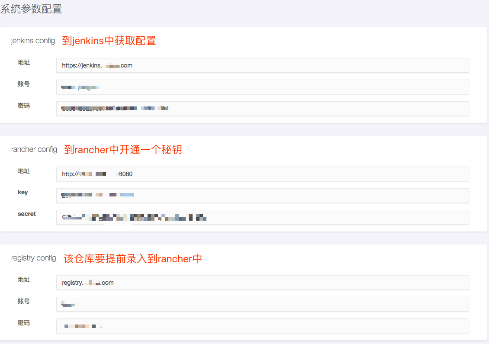
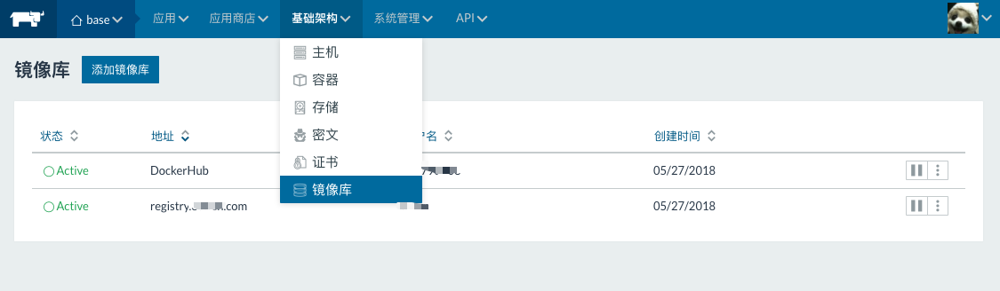
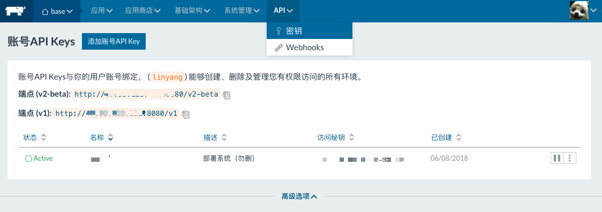
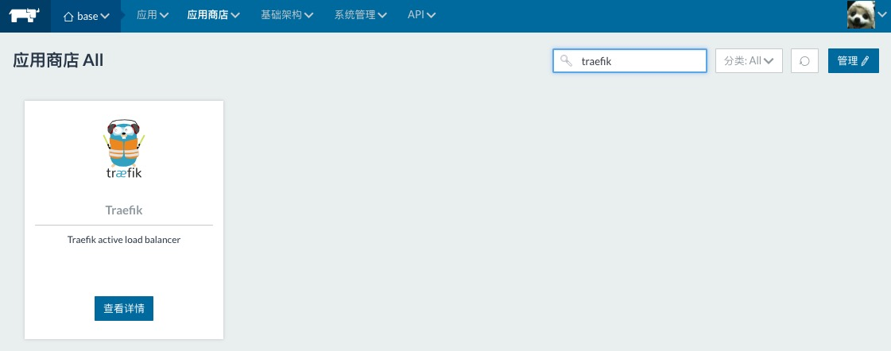
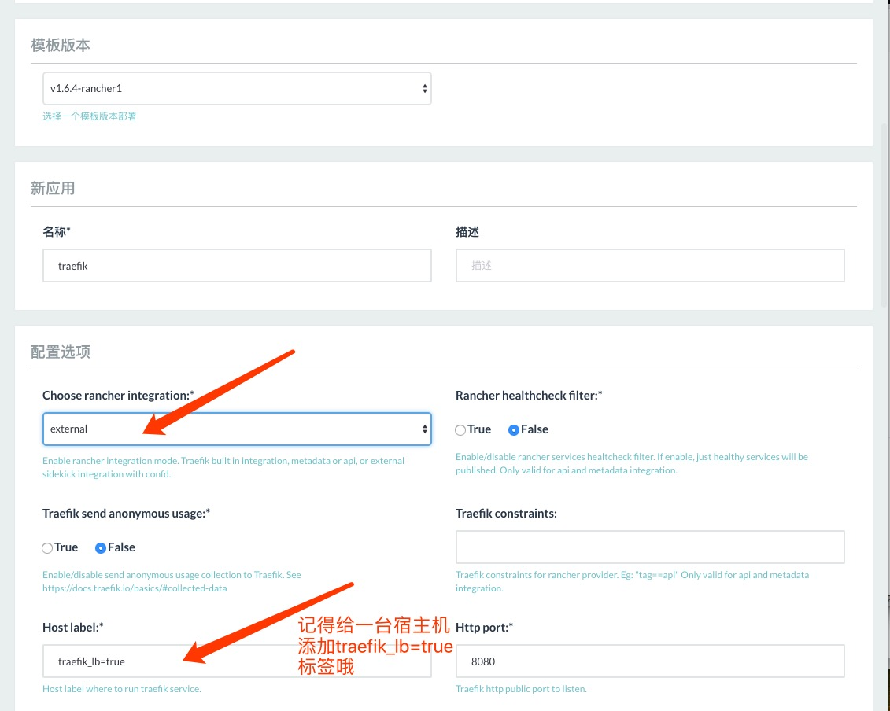
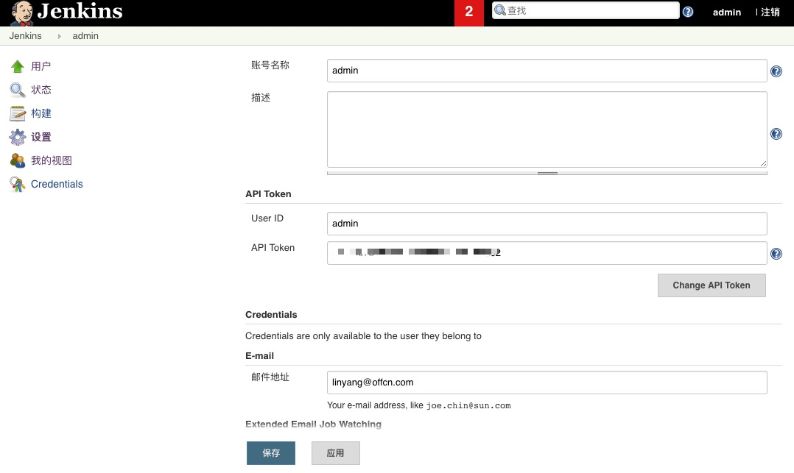
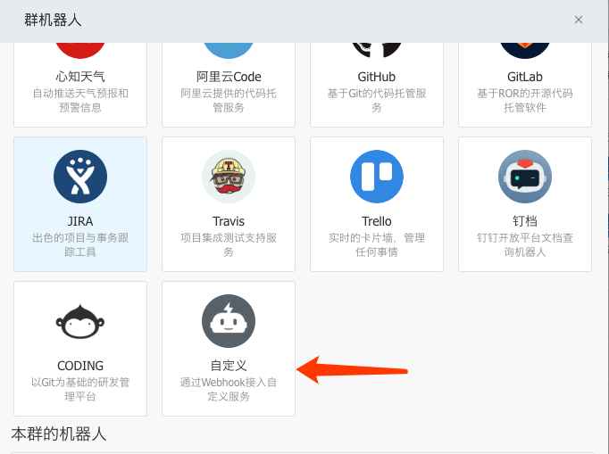

## <...CORECD...>
rancher+jenkins+cicd 自动集成自动部署
### 安装rancher
安装rancher v1.6,[去rancher官网查看](https://rancher.com/docs/rancher/v1.6/zh/quick-start-guide/)
### 安装jenkins
建议使用docker pull trion/jenkins-docker-client,[了解该镜像](https://store.docker.com/community/images/trion/jenkins-docker-client)
### docker run
```shell
docker run -d -it --restart=always \
    -e MYSQL_HOST=localhost \
    -e MYSQL_PORT=3306 \
    -e MYSQL_USERNAME=root \
    -e MYSQL_PASSWORD=root \
    -e REDIS_HOST=localhost \
    -e REDIS_PORT=6379 \
    -e REDIS_PASSWORD=XX \
    --name corecd \
    lin2798003/corecd:latest
```
参数详解:
* MYSQL_HOST:远程mysql连接地址
* MYSQL_PORT:远程mysql端口
* MYSQL_USERNAME:远程mysql账号
* MYSQL_PASSWORD:远程mysql密码
* REDIS_HOST:远程redis连接地址
* REDIS_PORT:远程redis端口
* REDIS_PASSWORD:远程redis密码
### rancher初始化配置
* 确保录入的节点宿主机上配置了```corecd.nodes=true```或```corecd.jobs=true```
* 搜索catalog中的traefik进行安装安装模式为external形式
* traefik无需支持https
* 最外层nginx入口机或者slb负载均衡器需要将tcp 80以四层代理转发给traefik的ip:port
* 最外层nginx入口机或者slb负载均衡器需要将https 443以七层代理转发给traefik的ip:port
* nginx入口机或者slb负载均衡器当然是你自己搞定啊。。。别说你不会:)
### 注意事项
* corecd初始化需要一定的时间
* 初始管理员账号和totp url 请使用docker logs -f corecd查看
* corecd登录必备app:google authenticator,打开appsotre搜索或者其他秘钥工具都可以
* web外网和内网服务会自动部署至(具备```corecd.nodes=true```标签的)宿主机上
* job任务服务会自动将service部署至(具备```corecd.jobs=true```标签的)宿主机上
### corecd系统配置项
* corecd所需系统配置项


* rancher registry配置


* rancher api key配置


* rancher catalog traefik配置


* rancher traefik配置


* jenkins账户和token录入


* 申请钉钉群报警机器人url
